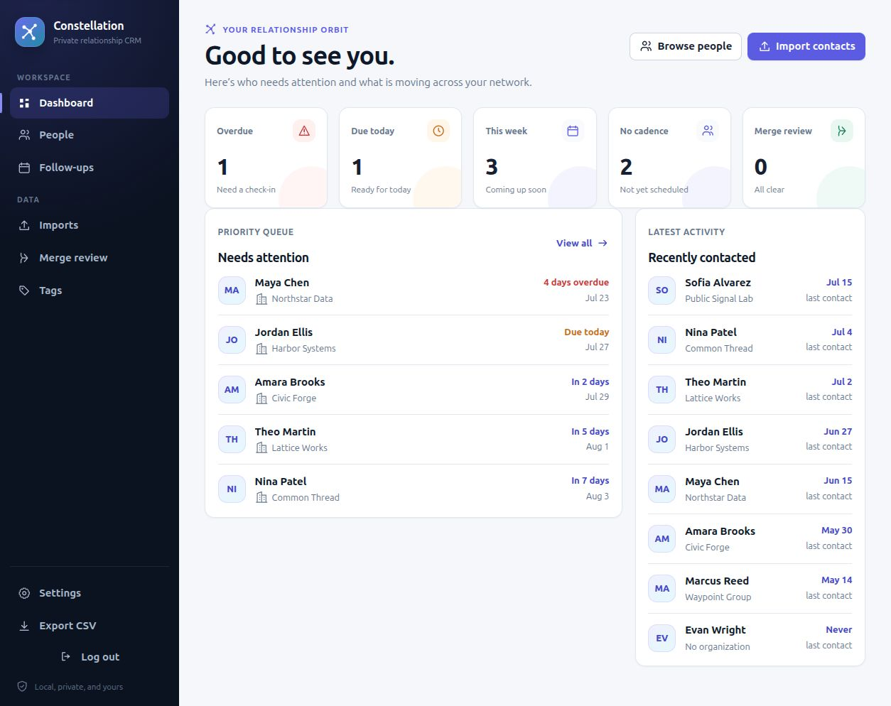
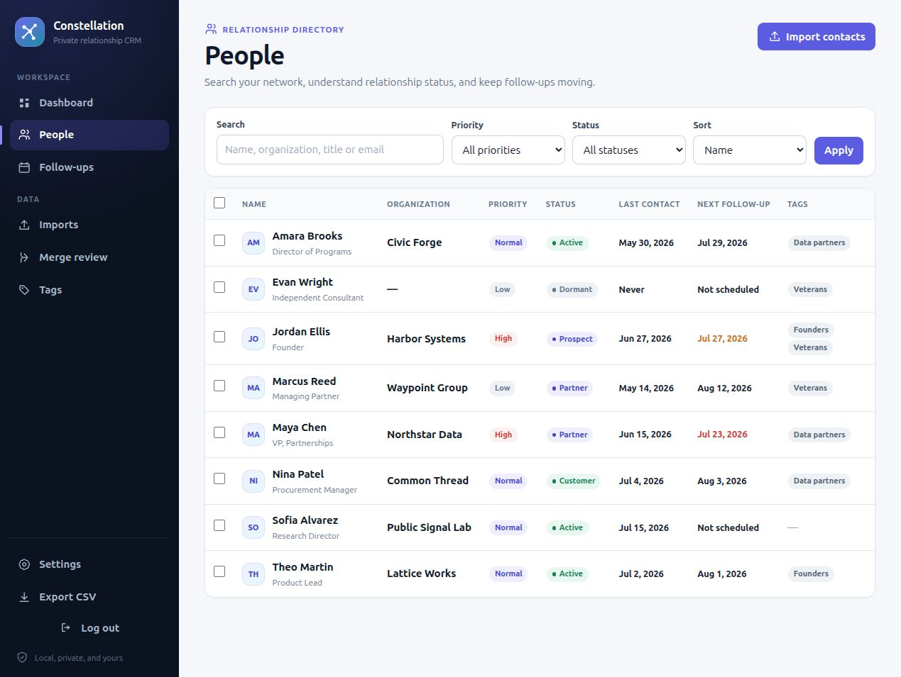
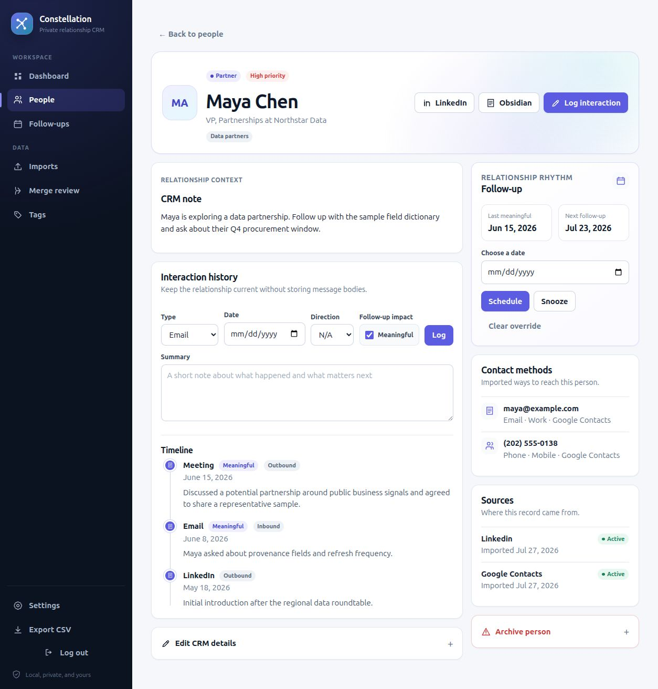

<p align="center">
  
</p>

<h1 align="center">Constellation</h1>

<p align="center">
  A private, single-user relationship CRM for deciding who to contact and when.
</p>



Constellation combines Google Contacts and LinkedIn connection exports with private relationship metadata, interaction history, follow-up cadence, and links into Obsidian.

> **Privacy by design:** no telemetry, third-party analytics, outreach automation, email-body storage, or LinkedIn scraping. The optional ChatGPT MCP connector is disabled by default and only returns records requested through its read-only tools.

The boundary is deliberate:

- Constellation handles who, when, operational status, source identities, and cadence.
- Obsidian handles why the relationship matters, meeting notes, background, strategy, and discussion topics.

## How it works

1. **Import** Google Contacts and LinkedIn connection snapshots.
2. **Prioritize** people with private status, tags, priority, and follow-up cadence.
3. **Follow up** from a focused queue and preserve lightweight interaction history.

<details>
<summary><strong>More screenshots</strong></summary>

### Relationship directory



### Person profile and interaction timeline



</details>

## Current MVP

- Google Contacts and LinkedIn Connections CSV imports
- Canonical people separated from provider identities and source rows
- Multiple emails, phone numbers, URLs, employment records, tags, and interactions
- Deterministic matching by LinkedIn URL, email, phone, or name plus organization
- No automatic name-only merges
- Manual merge review that preserves contact methods, identities, interactions, employment, and tags
- Auditable import batches, duplicate-file idempotency, and LinkedIn snapshot status
- Search, filters, sorting, continuous scrolling, bulk tagging, and bulk cadence assignment
- Due, overdue, and upcoming follow-up views
- Meaningful interaction logging and follow-up recalculation
- Quick interaction logging from People and Follow-ups
- A focused Today view for due relationships, upcoming follow-ups, and recent momentum
- Printable meeting-preparation briefs with relationship context and conversation prompts
- Saved People segments with reusable search, tag, status, priority, and timing filters
- Data-quality center for missing contact details, context, tags, and cadence
- One-click LinkedIn shortcuts from contact lists and profiles
- Manual scheduling, snoozing, cadence pausing in the data model, and archiving
- Obsidian URI storage and helper endpoint
- CSV export with spreadsheet-formula-injection protection
- Google Contacts-compatible CSV export that preserves LinkedIn URLs, labels, notes, and CRM metadata
- Optional Argon2 password authentication and CSRF protection
- Optional bearer-protected, read-only ChatGPT MCP connector
- Field-by-field merge decisions and one-click undo for new merges
- SQLite backup and restore scripts
- Non-root, read-only Docker deployment

## Architecture

```text
Browser
  |
FastAPI + Jinja2 forms
  |
Service layer
  |- provider CSV parsers
  |- normalization and matching
  `- follow-up calculation
  |
SQLAlchemy 2 + SQLite
  |- canonical people
  |- external identities and original source payloads
  |- contact methods and employment
  |- interactions, tags, merge review/history
  `- import batches

ChatGPT
  |
Private tunnel + bearer token
  |
Read-only MCP service
  `- bounded relationship tools
```

Provider-specific parsing ends at `ImportedRecord`. Matching and persistence operate on that normalized record, which is the seam intended for a future Google People API adapter.

## Deploy through Portainer on `docker-server`

Clone and build the application on `docker-server`:

```bash
ssh docker-server
mkdir -p ~/docker
git clone https://github.com/Remulous/constellation.git ~/docker/constellation
cd ~/docker/constellation
docker build -t constellation:latest .
```

Generate a session secret:

```bash
docker run --rm --entrypoint python constellation:latest \
  -c "import secrets; print(secrets.token_urlsafe(48))"
```

Generate an optional password hash:

```bash
docker run --rm --entrypoint python constellation:latest \
  -c "from argon2 import PasswordHasher; print(PasswordHasher().hash('choose-a-long-password'))"
```

In Portainer:

1. Create a stack named `constellation`.
2. Paste `compose.yaml` into the stack editor.
3. Add `SESSION_SECRET` and the other desired values under **Environment variables**.
4. Deploy the stack.

Open `http://docker-server:8000` from another homelab device.

The default bind address is `0.0.0.0`, making the service reachable from the
LAN. For tighter control, set `CRM_BIND_ADDRESS` in `.env` to the Docker
server's LAN IP and restrict the port with the host firewall. If a reverse
proxy runs on the same server, set `CRM_BIND_ADDRESS=127.0.0.1`, route private
HTTPS to port 8000, and leave `SECURE_COOKIES=true`.

The example environment uses `SECURE_COOKIES=false` for direct homelab HTTP.
Change it to `true` when the application is served through HTTPS; otherwise
login sessions will not persist over plain HTTP. Do not forward port 8000 from
the internet.

The container runs database migrations at startup. SQLite lives in the `constellation_data` Docker volume and survives container replacement.

## Environment variables

| Variable | Purpose | Default |
| --- | --- | --- |
| `APP_PASSWORD_HASH` | Argon2 application password hash; empty disables app auth | empty |
| `SESSION_SECRET` | Signs session cookies; set a long random value | insecure placeholder |
| `SECURE_COOKIES` | Sends session cookie only over HTTPS | `true` |
| `MAX_UPLOAD_MB` | Maximum accepted CSV size | `10` |
| `MAX_MINUTES_UPLOAD_MB` | Maximum reviewed-minutes document size | `16` |
| `OBSIDIAN_VAULT` | Default vault for URI construction | empty |
| `PUBLIC_URL` | Canonical contact-link URL and allowed MCP host | `http://localhost:8000` |
| `MCP_API_TOKEN` | Enables and protects the read-only MCP service | empty/disabled |
| `CRM_DATA_DIR` | Database and default backup directory | `/data` |
| `DATABASE_URL` | Optional SQLAlchemy override, mainly for development | derived from data dir |
| `CRM_BIND_ADDRESS` | Docker host interface published by Compose | `0.0.0.0` |
| `CRM_PORT` | Docker host port published by Compose | `8000` |

If testing over plain local HTTP, set `SECURE_COOKIES=false`. Turn it back on behind HTTPS.

## Local development

Python 3.12 is required.

```bash
python -m venv .venv
. .venv/bin/activate
pip install -e ".[test]"
export CRM_DATA_DIR="$PWD/data"
export SECURE_COOKIES=false
alembic upgrade head
uvicorn app.main:app --reload
```

Run tests with:

```bash
pytest
```

## Exporting source files

### Google Contacts

In Google Contacts, choose **Export**, select the contacts or label you want, choose **Google CSV**, and download the file. Import it under **Imports → Google Contacts**.

Google exports vary. The parser tolerates BOMs, reordered or extra columns, Unicode, empty columns, quoted commas, multiple numbered emails and phones, and the common `Given Name`/`Family Name` and `First Name`/`Last Name` variants.

### LinkedIn

In LinkedIn, open **Settings & Privacy → Data privacy → Get a copy of your data**, request **Connections**, and download `Connections.csv` when it is ready. Import it under **Imports → LinkedIn Connections**.

LinkedIn is treated as a periodic snapshot. A connection missing from a later snapshot is marked inactive at the external-identity level; the person is never automatically deleted.

## Import and matching rules

Each upload is hashed. Re-uploading an identical completed file returns the prior batch instead of duplicating records.

Automatic matching is deterministic and ordered:

1. Exact normalized LinkedIn profile URL
2. Exact normalized email
3. Exact normalized phone
4. Provider record identifier, when supplied
5. Exact normalized full name plus normalized organization

Name-only similarity creates a manual merge candidate. It never merges automatically. Original source rows are retained as JSON for troubleshooting; uploaded CSV files themselves are not retained.

Source data may add or refresh imported contact details. Re-import does not overwrite private CRM fields such as priority, relationship status, cadence, notes, tags, or Obsidian URI.

## VetBiz reviewed-minutes workflow

Open **VetBiz minutes** to upload or paste finalized, human-reviewed meeting notes. Version 1 accepts Markdown, plain text, and text-based RTF. It does not accept raw transcripts, recordings, OCR, DOCX, or PDF.

The workflow is deliberately staged:

1. Confirm that the source completed human review.
2. Parse the source locally into an import record and review candidates.
3. Review extracted contacts, organizations, meeting interactions, sourced offers/asks, follow-ups, possible Remulous Labs product fits, and possible introductions.
4. Edit, match, approve, or reject each candidate.
5. Commit only approved candidates in one database transaction.

Parsing never creates or updates durable contacts, opportunities, signals, follow-ups, or connection suggestions. Exact-email meeting interactions have a dedicated low-risk bulk-approval action; fuzzy contact matches, opportunities, and introductions never support bulk approval.

Each committed result retains its import record, source excerpt, review decision, and committed entity identifier. Duplicate files are detected by checksum. A changed file with the same meeting title and date is marked as a possible revision, and matching sourced interactions or signals are reused when possible.

RTF extraction treats formatting and embedded content as untrusted. Pictures and unsupported formatting are ignored, while malformed, protected, object-bearing, deeply nested, oversized, or otherwise suspicious files are rejected. Older minutes with image-only contact lists can preserve their readable text but cannot yield contact rows without OCR.

Undoing a committed reviewed-minutes import is deferred. Constellation can atomically prevent a partial commit, but safely reversing later contact-field additions or follow-up-date changes requires field-level ownership history so an undo cannot erase subsequent manual edits. Until that history exists, restore a database backup for full rollback and use the import audit page to review exactly what was committed.

## Merge review

Open **Merge review** to compare uncertain matches. Approving a merge lets you choose the surviving person and the preferred value for each scalar field. Alternate contact methods, external identities, employment, interactions, and tags are reassigned rather than discarded. A complete merge-history snapshot supports one-click undo for new merges.

Legacy merge-history entries remain visible but cannot be undone automatically. Restoring a pre-merge database backup remains the recovery path for those entries.

## ChatGPT MCP connector

Constellation includes a separate, read-only MCP service at:

```text
https://your-constellation-host/mcp
```

It exposes four bounded tools: `search_people`, `get_person`, `list_followups`, and `relationship_overview`. The connector cannot execute arbitrary SQL or modify records. Results are capped, and contact results link back to the canonical Constellation record.

Generate a dedicated token:

```bash
python -c "import secrets; print(secrets.token_urlsafe(48))"
```

Set `MCP_API_TOKEN` and `PUBLIC_URL` in the Portainer stack environment, rebuild the image, and recreate both Compose services. Configure the MCP client to send:

```text
Authorization: Bearer YOUR_MCP_API_TOKEN
```

ChatGPT connects to remote MCP endpoints. For a private homelab deployment, use OpenAI's Secure MCP Tunnel rather than exposing Constellation directly to the public internet. Only records retrieved for a question are returned through the connector, but those returned fields leave the local instance and are processed by the connected ChatGPT service.

## Follow-ups

For a person with cadence:

```text
next follow-up = last meaningful interaction + cadence days
```

A manual date overrides that result. An active snooze takes precedence. Logging a new meaningful interaction clears the prior override and snooze, updates the last meaningful interaction date, and calculates a new due date. Non-meaningful notes remain in the timeline without changing cadence.

## Obsidian

Paste a complete Obsidian URI into a person record:

```text
obsidian://open?vault=Remulous%20Labs&file=People%2FJerry%20Mathis
```

The contact page then shows **Open in Obsidian**. The helper endpoint also constructs an encoded URI:

```text
GET /obsidian-uri?vault=Remulous%20Labs&path=People/Jerry%20Mathis
```

No note content is synchronized.

## Backup and restore

Create a transactionally consistent backup while the app is running:

```bash
docker exec constellation ./scripts/backup.sh
```

To copy it off the Docker volume, either mount a host backup directory or use `docker cp`.

Restore with the application stopped:

```bash
docker compose stop constellation
docker compose run --rm constellation ./scripts/restore.sh /data/backups/constellation-TIMESTAMP.db
docker compose up -d
```

The restore script checks SQLite integrity and preserves the replaced database as `constellation.db.before-restore`.

## Updating

Back up first, pull the source, rebuild the local image, and use Portainer to
recreate the stack:

```bash
docker exec constellation ./scripts/backup.sh
cd ~/docker/constellation
git pull --ff-only
docker build -t constellation:latest .
```

Alembic applies schema upgrades during startup.

## Security notes

- Use HTTPS at the reverse proxy and keep `SECURE_COOKIES=true`.
- Set `APP_PASSWORD_HASH` even on a private network unless an upstream identity-aware proxy already authenticates access.
- Never commit `.env`.
- Restrict access to the Docker host and volume; the database contains sensitive relationship data.
- The container runs as an unprivileged user, drops Linux capabilities, uses `no-new-privileges`, and has a read-only root filesystem.
- HTML templates escape values by default. Mutating forms use session-bound CSRF tokens.
- CSV uploads are size- and extension-limited. They are parsed in memory and not persisted.
- Reviewed-minutes uploads are size- and type-limited, rendered with template escaping, and parsed locally without executing RTF objects or fetching external references.
- Dependency versions are pinned in `pyproject.toml`.

## Known limitations

- Google and LinkedIn formats change; inspect and extend header aliases when an actual export contains new columns.
- Google addresses, birthdays, labels, notes, and websites remain in the preserved source payload but do not yet have dedicated editing UI.
- Imported professional changes are added to employment history; the UI does not yet provide a full employment editor.
- Application settings are environment-based rather than editable in the browser.
- No live Google synchronization or outbound communication exists.
- Reviewed-minutes DOCX/PDF extraction and OCR are intentionally deferred; image-only contact lists remain source text without structured candidates.
- Reviewed-minutes commits are atomic, but one-click post-commit rollback is deferred until imported field ownership can be reversed without overwriting later manual edits.

## Future Google People API synchronization

Add a `GooglePeopleProvider` adapter that emits the same `ImportedRecord` model used by CSV imports. The first release should be one-way Google-to-CRM:

1. OAuth authorization with least-privilege Contacts read scope
2. Encrypted refresh-token storage
3. Initial full connection sync
4. Incremental `syncToken` requests
5. Recovery from expired sync tokens with a controlled full sync
6. Deletion markers applied only to the Google external identity
7. Existing source precedence and private-field protection
8. Audit batches for API sync runs

Two-way sync should remain optional and come only after field ownership and conflict behavior are explicit.
